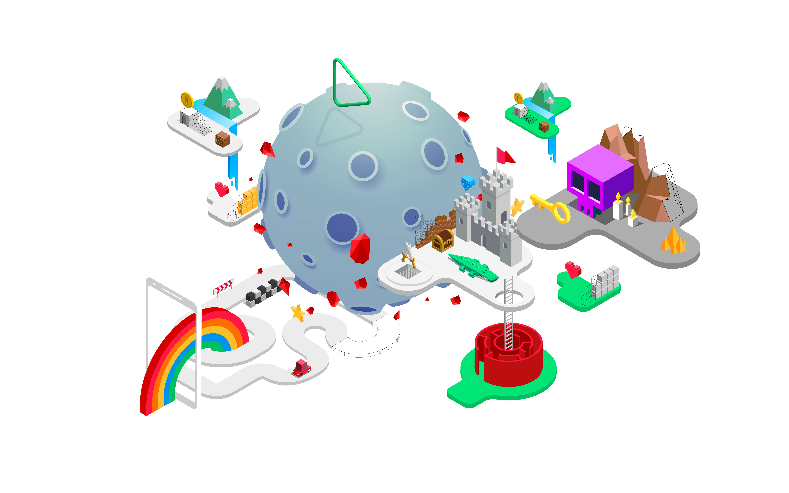
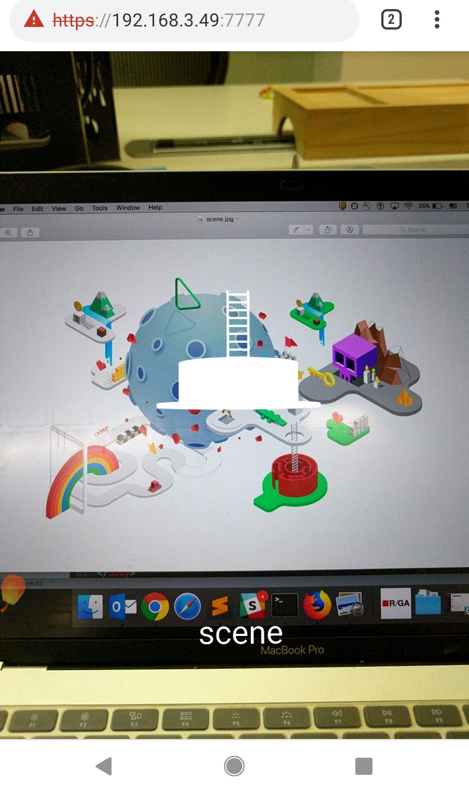

A marker-based AR example from [8-th wall](https://github.com/8thwall/web/tree/master/examples)

Todo:
- [ ] Use json or gltf model with animation
- [ ] Add interaction with human body

Maker

Screenshot

